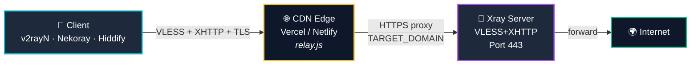
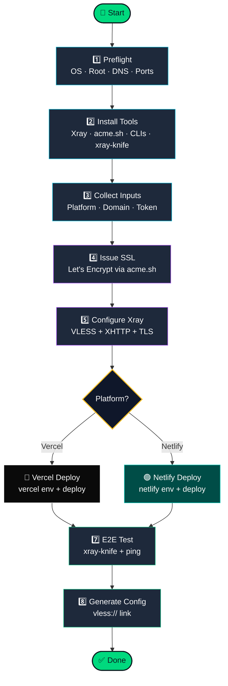

<div align="center">

<a href="https://t.me/avaco_cloud">
  
</a>

<br/>

### 🌐 Automated VLESS + XHTTP + TLS Proxy with Vercel/Netlify CDN Relay

<br/>

**🌐 Language:** [🇮🇷 فارسی](README.md) • [🇬🇧 English](README_EN.md) • [🇨🇳 中文](README_ZH.md)

<br/>

[](https://t.me/avaco_cloud)
[](#)
[](#)
[](#)

<br/>

[](#)
[](#)
[](#)
[](#)

<br/>

### ⚡ One-line install

</div>

```bash
bash <(curl -fsSL https://raw.githubusercontent.com/ZhengYuHangOvO/XHTTP-Installer/main/install.sh)
```

<div align="center">

---

</div>

## ✨ What is this?

A **one-command** installer for **VLESS + XHTTP + TLS** proxy on Ubuntu, using free **Vercel** or **Netlify** CDN as the relay layer.

> [!TIP]
> Instead of clients connecting directly to your server (which exposes your IP), traffic flows through an Edge Function on a well-known CDN platform — your real server IP stays hidden.

<br/>

### 🎯 Why this installer?

| Feature | Description |
|---------|-------------|
| 🌐 **No network domain needed** | Just a simple subdomain with an A record |
| 🛠️ **Zero CLI hassle** | Vercel CLI & Netlify CLI installed and authenticated automatically |
| 🐛 **Smart Auto-Fix** | Detects and resolves SSL, firewall, token, and ENV issues |
| ✅ **End-to-end validation** | Uses `xray-knife` to verify the generated config actually works |
| 🔄 **Auto-retry on failure** | Re-attempts deploy/SSL with corrective fixes |
| 🛡️ **Hides server IP** | Only the CDN edge is exposed publicly |
| 🔐 **Auto SSL** | Let's Encrypt certificate via acme.sh |
| 🇮🇷 **Iran-friendly** | Works without a VPN during installation |

<br/>

---

## 🔄 How it works

### Architecture



> [!NOTE]
> The **CDN is the public layer**, your **Xray server is hidden**. The outside world only sees the CDN domain.

<br/>

### Automation phases



<br/>

<details open>
<summary><b>1️⃣ Phase 1 — Preflight</b></summary>

<br/>

Verifies the server is ready:
- ✅ OS is Ubuntu 20.04+
- ✅ Running as **root**
- ✅ Internet connectivity OK
- ✅ Ports 80 and 443 are free (auto-fix if not)
- ✅ DNS is pointed correctly

</details>

<details>
<summary><b>2️⃣ Phase 2 — Install tools</b></summary>

<br/>

Installs everything automatically:

| Tool | Purpose |
|------|---------|
| **Xray-core** | Proxy core (VLESS+XHTTP) |
| **acme.sh** | Let's Encrypt SSL certificate |
| **Node.js + npm** | Required for platform CLIs |
| **Vercel CLI** | If you picked Vercel |
| **Netlify CLI** | If you picked Netlify |
| **xray-knife** | End-to-end config validator |
| **curl, jq, unzip, screen** | Utilities |

> [!NOTE]
> No need to pre-install any CLI — the script handles install + auth.

</details>

<details>
<summary><b>3️⃣ Phase 3 — Collect inputs</b></summary>

<br/>

Interactively asks for:

| Question | Example | Required? |
|----------|---------|-----------|
| Platform | Vercel / Netlify | ✅ |
| Domain | `ns.example.com` | ✅ |
| SSL email | `admin@example.com` | ⬜ (default) |
| Xray port | `443` | ⬜ (default) |
| Relay path | `/api` | ⬜ (default) |
| **Platform token** | Vercel/Netlify token | ✅ |
| Project name | `relay-abc123` | ⬜ (random) |

</details>

<details>
<summary><b>4️⃣ Phase 4a — Issue SSL certificate</b></summary>

<br/>

- 🔐 Gets cert from **Let's Encrypt** via `acme.sh`
- 📁 Stores it in `/etc/ssl/xhttp/<domain>/`
- 🔄 Auto-fix if port 80 is busy
- ♻️ Enables auto-renewal

</details>

<details>
<summary><b>5️⃣ Phase 4b — Configure Xray</b></summary>

<br/>

- 🎲 Generates a unique **UUID**
- 📝 Writes `/usr/local/etc/xray/config.json` with VLESS+XHTTP+TLS
- 🔑 Fixes SSL file permissions for Xray
- 🚀 Starts and enables the Xray service
- ✅ Verifies the service is running healthy

</details>

<details>
<summary><b>6️⃣ Phase 4c — Deploy to CDN</b></summary>

<br/>

Based on the selected platform:

**🔵 Vercel:**
- Login with token → `vercel login`
- Create project → `vercel project add`
- Set ENV: `TARGET_DOMAIN`, `UPSTREAM_PROTOCOL`, `RELAY_PATH`
- Deploy production → `vercel deploy --prod`

**🟢 Netlify:**
- Login with token → `netlify login`
- Create site → `netlify sites:create`
- Set ENV: `TARGET_DOMAIN`
- Deploy with Edge Function → `netlify deploy --prod`

> [!TIP]
> If deploy fails, auto-fix retries it after resolving the previous issue (ENV, duplicate name, token).

</details>

<details>
<summary><b>7️⃣ Phase 5 — End-to-end test</b></summary>

<br/>

- 🧪 Creates a temporary xray client with `xray-knife`
- 🌐 Routes real traffic: CDN → Server → Internet
- ⏱️ Measures ping (min/avg/max)
- ✅ Confirms the config **actually works** before handing it to you

</details>

<details>
<summary><b>8️⃣ Phase 6 — Generate final config</b></summary>

<br/>

- 📋 `vless://...` link ready to copy
- 📊 Full report: relay URL, UUID, test result, ping, quality
- 💾 Full log at `/tmp/xhttp-install.log`

</details>

<br/>

---

## 📋 Requirements

### 1. Ubuntu Server

- **OS**: Ubuntu 20.04+ (22.04 recommended)
- **Access**: root or sudo
- **Ports**: 80 (for SSL) and 443 (for relay)
- **Min resources**: 1 vCPU + 1 GB RAM

> [!IMPORTANT]
> Make sure ports 80 and 443 are free. If you have nginx/apache running on them, stop those services first.

### 2. Domain with DNS

A subdomain with an A record pointing to your **server IP**:
```
ns.example.com  →  YOUR_SERVER_IP
```

### 3. CDN Token (one of)

#### 🔵 Vercel Token
```
https://vercel.com/account/tokens
```
→ **Create Token** → name it → copy

#### 🟢 Netlify Token
```
https://app.netlify.com/user/applications#personal-access-tokens
```
→ **New access token** → name it → copy

<br/>

---

## 🚀 Quick Start

### 📥 Step 1 — One-line install

SSH into your server and run:

```bash
bash <(curl -fsSL https://raw.githubusercontent.com/ZhengYuHangOvO/XHTTP-Installer/main/install.sh)
```

> [!TIP]
> This installs `git`, clones the repo into `/root/XHTTP-Installer`, and runs `Deploy-Ubuntu.sh` for you.

<details>
<summary><b>Alternative methods</b></summary>

<br/>

**Manual git clone:**
```bash
git clone https://github.com/ZhengYuHangOvO/XHTTP-Installer.git /root/XHTTP-Installer
cd /root/XHTTP-Installer
sudo bash Deploy-Ubuntu.sh
```

**Offline zip:**
```bash
scp XHTTP-Installer.zip root@SERVER_IP:/root/
ssh root@SERVER_IP
cd /root && unzip XHTTP-Installer.zip && sudo bash Deploy-Ubuntu.sh
```

</details>

The script first asks if you want to run inside `screen`:

- If your **internet is unstable** or SSH drops often → press `Y`. If SSH drops mid-install:
  ```bash
  ssh root@SERVER_IP
  screen -r xhttp
  ```
- If your connection is stable → press `n` and continue directly

> [!TIP]
> If SSH drops while inside `screen`, just reconnect and run `screen -r xhttp` to resume.

### 🎯 Step 2 — Choose platform

```
[ Deployment Platform ]
Choose relay platform:
  1) Vercel
  2) Netlify
Enter choice [1/2]:
```

### ⚙️ Step 3 — Provide info

The script asks step by step. Pressing `Enter` accepts the default:

| Question | Description | Example / Default |
|----------|-------------|-------------------|
| **Domain** | Subdomain pointing to your server IP | `ns.example.com` |
| **Email** | For SSL certificate (optional) | `admin@ns.example.com` |
| **Inbound port** | Port Xray listens on | `443` |
| **RELAY_PATH** | Inbound path on server | `/api` |
| **PUBLIC_RELAY_PATH** | Relay path on CDN | `/api` |
| **Token** | Vercel or Netlify token | paste it |
| **Project name** | CDN site name (random by default) | `relay-abc123` |
| **Performance settings** | Vercel only (Enter = default) | `128`, `50000`, ... |

### 🎉 Step 4 — Wait and grab the config

```
╔══════════════════════════════════════════╗
║       INSTALLATION COMPLETE  ✔         ║
╚══════════════════════════════════════════╝

  Platform         : netlify
  Relay URL        : https://your-site.netlify.app
  
  E2E Proxy Test   : ✔ PASS
  Ping (min/avg/max): 395/424/480 ms
  Quality          : Good

── Client Config ──

vless://xxxxxxxx...@your-site.netlify.app:443?...#XHTTP-netlify
```

✅ Copy the `vless://...` link.

<br/>

---

## 📱 Use the config

| Platform | App | How |
|----------|-----|-----|
| 🪟 Windows | [v2rayN](https://github.com/2dust/v2rayN/releases) | Servers → Import bulk URL from clipboard |
| 🤖 Android | [v2rayNG](https://play.google.com/store/apps/details?id=com.v2ray.ang) | + → Import config from clipboard |
| 🍎 iOS | Streisand (App Store) | Auto-detects from clipboard |
| 🐧 Linux | [Nekoray](https://github.com/MatsuriDayo/nekoray/releases) | Program → Add profile from clipboard |
| 🌐 All | [Hiddify](https://hiddify.com) | Add → Add from Clipboard |

<br/>

---

## 🛠️ Script Features

### 🤖 Smart Auto-Fix

| Issue | Auto-Fix |
|-------|----------|
| Port 80 busy | Kills the process |
| Firewall blocking | `ufw allow` automatic |
| Xray + SSL key permission | `chmod` + `chgrp` automatic |
| systemd service issue | drop-in override |
| Invalid token | Re-prompts for new token |
| Netlify duplicate name | New random name |

### 🧪 End-to-End Test

After deploy, the script tests the proxy with a temporary xray client:

```
✔ VLESS+XHTTP WORKS END-TO-END
  HTTP 204 in 0.475s — proxy is functional
  Ping (min/avg/max): 395/424/480 ms (through VLESS)
  Quality: Good
```

So **before** you even open your client, you know the proxy works.

<br/>

---

## 🐛 Troubleshooting

<details>
<summary><b>❌ Xray "permission denied" on privkey.pem</b></summary>

<br/>

The script **auto-fixes** this via a systemd drop-in. Manual fix:
```bash
chmod 640 /etc/ssl/xhttp/YOUR_DOMAIN/privkey.pem
chgrp nobody /etc/ssl/xhttp/YOUR_DOMAIN/privkey.pem
```
</details>

<details>
<summary><b>❌ HTTP 500 from Netlify (Misconfigured)</b></summary>

<br/>

`TARGET_DOMAIN` env var not set. Auto-retry usually fixes it. Manual:
```bash
cd /root/deploy/netlify
netlify env:set TARGET_DOMAIN "https://YOUR_DOMAIN:443" \
  --scope functions --context production --site SITE_ID
netlify deploy --prod
```
</details>

<details>
<summary><b>❌ HTTP 404 from relay</b></summary>

<br/>

**Normal** for non-VLESS requests. `curl` returns 404 because it doesn't send a VLESS handshake. Real clients (v2rayN, Nekoray, ...) work fine.
</details>

<details>
<summary><b>📝 Full log</b></summary>

<br/>

```bash
tail -f /tmp/xhttp-install.log
```
</details>

<br/>

---

## 🛡️ Ethics

> [!WARNING]
> This project is built only to **bypass unjust restrictions** and **protect privacy**.
> 
> ❌ Do **not** use it for malicious activity, attacks, or violating others' privacy.
> 
> ❌ Do **not** use third-party domains/tokens **without permission**.
> 
> ✅ Run it only on **your own** server and CDN account.

<br/>

---

## 📜 License & Copyright

This project is licensed under the **[GNU GPL-3.0](LICENSE)**.

**Copyright © 2025 [@avaco_cloud](https://t.me/avaco_cloud)**

> [!IMPORTANT]
> ✅ Personal and commercial use is **allowed**
> ✅ Modification and forking is **allowed**
> 
> ❗ However, **any copy, fork, or redistribution** MUST preserve:
> - 📌 The original copyright notice (`Copyright © 2025 avaco_cloud`)
> - 📌 A link to the original repo: https://github.com/ZhengYuHangOvO/XHTTP-Installer
> - 📌 Attribution to [@avaco_cloud](https://t.me/avaco_cloud) as the original author
> - 📌 The `LICENSE` file unchanged
> 
> ❌ Removing or altering these is a **copyright violation** and will result in a **DMCA takedown**.

If you find someone using this code **without complying with the license**, contact [@avaco_cloud](https://t.me/avaco_cloud).

<br/>

---

<div align="center">

## 💖 Support

If this project helped you, consider a crypto donation:

<a href="https://nowpayments.io/donation?api_key=53edc3b4-8a65-451a-9ca9-67c30519c7a5" target="_blank" rel="noreferrer noopener">
  
</a>

<br/><br/>

---

## 🙏 Acknowledgments

Special thanks to these amazing developers for their inspiration and contributions:

<table>
<tr>
<td align="center">
<a href="https://github.com/amirshaker000">
<br/>
<b>@amirshaker000</b>
</a>
</td>
<td align="center">
<a href="https://github.com/B3hnamR">
<br/>
<b>@B3hnamR</b>
</a>
</td>
</tr>
</table>

<br/>

---

## 💬 Questions?

📢 **Telegram:** [@avaco_cloud](https://t.me/avaco_cloud)

<br/>

**If you find this project useful, give it a ⭐ and share it!**

<br/>

Made with ❤️ by [@avaco_cloud](https://t.me/avaco_cloud)

</div>
