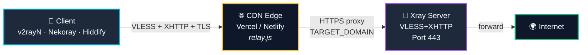
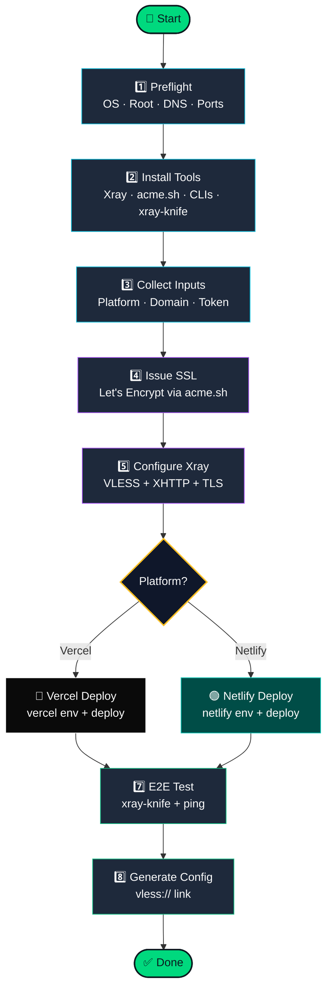

<div align="center">

<a href="https://t.me/avaco_cloud">
  
</a>

<br/>

### 🌐 نصب خودکار پروکسی با Relay روی Vercel یا Netlify

<br/>

**🌐 زبان:** [🇮🇷 فارسی](README.md) • [🇬🇧 English](README_EN.md) • [🇨🇳 中文](README_ZH.md)

<br/>

[](https://t.me/avaco_cloud)
[](#)
[](#)
[](#)

<br/>

[](#)
[](#)
[](#)
[](#)

<br/>

### ⚡ نصب سریع با یک دستور

</div>

```bash
bash <(curl -fsSL https://raw.githubusercontent.com/zsigoio/XHTTP-Installer/main/install.sh)
```

<div align="center">

---

</div>

## 📑 فهرست مطالب

- [✨ این پروژه چیه؟](#-این-پروژه-چیه)
- [🔄 چطور کار می‌کنه؟](#-چطور-کار-میکنه)
- [📋 پیش‌نیازها](#-پیشنیازها)
- [🚀 نصب در ۴ مرحله](#-نصب-در-۴-مرحله)
- [📱 استفاده از کانفیگ](#-استفاده-از-کانفیگ)
- [🛠️ ویژگی‌های اسکریپت](#️-ویژگیهای-اسکریپت)
- [🐛 عیب‌یابی](#-عیبیابی)
- [📜 مجوز](#-مجوز)

<br>

---

## ✨ این پروژه چیه؟

یه اسکریپت **یک‌خطی** برای راه‌اندازی پروکسی **VLESS+XHTTP+TLS** با استفاده از **CDN رایگان Vercel یا Netlify** به‌عنوان relay.

> [!TIP]
> **به‌جای** اینکه کلاینت مستقیم به سرور تو وصل شه (که IP لو میره و فیلتر میشه)، ترافیک از Edge Function یه پلتفرم معروف عبور می‌کنه — پس IP سرورت مخفی میمونه.

<br>

### 🎯 مزایا

| ویژگی | توضیح |
|--------|--------|
| 🛡️ **مخفی‌سازی IP** | IP سرور پشت CDN معتبر مخفی میشه |
| 🌍 **سرعت بالا** | ترافیک از CDN جهانی Netlify/Vercel |
| 💰 **رایگان** | با plan رایگان Vercel یا Netlify |
| 🔐 **TLS معتبر** | گواهی Let's Encrypt خودکار |
| ⚡ **یک خط نصب** | بدون تجربه یا نیاز به تنظیمات دستی |
| 🔁 **AutoFix هوشمند** | اگه چیزی خراب شد، خودکار درست می‌کنه |

<br>

---

## 🔄 چطور کار می‌کنه؟

### معماری کلی



> [!NOTE]
> **CDN لایه‌ی عمومی** و **سرور Xray لایه‌ی مخفی** هست. دنیای بیرون فقط دامنه‌ی CDN رو می‌بینه.

<br>

### فازهای اسکریپت



<br/>

<details open>
<summary><b>1️⃣ Phase 1 — Preflight (بررسی سیستم)</b></summary>

<br/>

چک می‌کنه که سرور برای نصب آماده باشه:
- ✅ سیستم‌عامل Ubuntu 20.04+ هست
- ✅ اسکریپت با دسترسی **root** اجرا شده
- ✅ اتصال اینترنت برقراره
- ✅ پورت‌های 80 و 443 آزادن (اگه نبود، auto-fix می‌کنه)
- ✅ DNS روی دامنه درست تنظیم شده

</details>

<details>
<summary><b>2️⃣ Phase 2 — نصب ابزارها</b></summary>

<br/>

این پکیج‌ها رو **خودکار** نصب می‌کنه:

| ابزار | کاربرد |
|-------|--------|
| **Xray-core** | هسته پروکسی (VLESS+XHTTP) |
| **acme.sh** | دریافت گواهی SSL از Let's Encrypt |
| **Node.js + npm** | پیش‌نیاز CLI پلتفرم‌ها |
| **Vercel CLI** | دیپلوی روی Vercel (اگه انتخاب شده) |
| **Netlify CLI** | دیپلوی روی Netlify (اگه انتخاب شده) |
| **xray-knife** | تست end-to-end کانفیگ |
| **curl, jq, unzip, screen** | ابزارهای کمکی |

> [!NOTE]
> نیازی نیست CLI رو خودت نصب کنی — اسکریپت همه چی رو می‌گیره و auth می‌کنه.

</details>

<details>
<summary><b>3️⃣ Phase 3 — دریافت اطلاعات</b></summary>

<br/>

به‌صورت **تعاملی** این سؤالا رو می‌پرسه:

| سؤال | مثال | اجباری؟ |
|------|------|---------|
| انتخاب پلتفرم | Vercel / Netlify | ✅ |
| دامنه | `ns.example.com` | ✅ |
| ایمیل SSL | `admin@example.com` | ⬜ (پیش‌فرض) |
| پورت Xray | `443` | ⬜ (پیش‌فرض) |
| مسیر relay | `/api` | ⬜ (پیش‌فرض) |
| **توکن پلتفرم** | Vercel/Netlify token | ✅ |
| اسم پروژه | `relay-abc123` | ⬜ (رندوم) |

</details>

<details>
<summary><b>4️⃣ Phase 4a — صدور گواهی SSL</b></summary>

<br/>

- 🔐 با `acme.sh` گواهی از **Let's Encrypt** می‌گیره
- 📁 توی `/etc/ssl/xhttp/<domain>/` ذخیره می‌کنه
- 🔄 اگه پورت 80 اشغال باشه، auto-fix انجام میده
- ♻️ تمدید خودکار رو هم فعال می‌کنه

</details>

<details>
<summary><b>5️⃣ Phase 4b — کانفیگ Xray</b></summary>

<br/>

- 🎲 یه **UUID یکتا** تولید می‌کنه
- 📝 فایل `/usr/local/etc/xray/config.json` می‌سازه با VLESS+XHTTP+TLS
- 🔑 دسترسی فایل‌های SSL رو برای Xray درست می‌کنه
- 🚀 سرویس Xray رو start/enable می‌کنه
- ✅ چک می‌کنه سرویس سالم بالا اومده

</details>

<details>
<summary><b>6️⃣ Phase 4c — دیپلوی روی CDN</b></summary>

<br/>

بسته به پلتفرم انتخابی:

**🔵 Vercel:**
- ورود با توکن → `vercel login`
- ایجاد پروژه → `vercel project add`
- ست کردن ENV: `TARGET_DOMAIN`, `UPSTREAM_PROTOCOL`, `RELAY_PATH`
- دیپلوی production → `vercel deploy --prod`

**🟢 Netlify:**
- ورود با توکن → `netlify login`
- ایجاد site → `netlify sites:create`
- ست کردن ENV: `TARGET_DOMAIN`
- دیپلوی با Edge Function → `netlify deploy --prod`

> [!TIP]
> اگه دیپلوی شکست خورد، auto-fix خودکار retry می‌کنه با حل کردن مشکل قبلی (ENV، اسم duplicate، توکن).

</details>

<details>
<summary><b>7️⃣ Phase 5 — تست end-to-end</b></summary>

<br/>

- 🧪 با `xray-knife` یه کلاینت موقت می‌سازه
- 🌐 از طریق CDN → Server → Internet ترافیک رو تست می‌کنه
- ⏱️ پینگ (min/avg/max) رو اندازه می‌گیره
- ✅ مطمئن میشه کانفیگ **واقعاً کار می‌کنه** قبل از اینکه بهت بده

</details>

<details>
<summary><b>8️⃣ Phase 6 — تولید کانفیگ نهایی</b></summary>

<br/>

- 📋 لینک `vless://...` آماده برای کپی
- 📊 گزارش کامل: URL relay، UUID، نتیجه تست، پینگ، کیفیت
- 💾 لاگ کامل توی `/tmp/xhttp-install.log`

</details>

<br>

---

## 📋 پیش‌نیازها

قبل از نصب این موارد رو آماده داشته باش:

### ۱. سرور Ubuntu

- **سیستم‌عامل**: Ubuntu 20.04 یا بالاتر (22.04 پیشنهاد می‌شه)
- **دسترسی**: root یا sudo
- **پورت‌ها**: 80 (برای SSL) و 443 (برای relay)
- **حداقل منابع**: 1 vCPU + 1GB RAM

> [!IMPORTANT]
> قبل از اجرا، از پورت 80 و 443 **صرفاً برای این اسکریپت** استفاده کن. اگه nginx/apache روی این پورت‌ها داری، اول خاموششون کن.

### ۲. دامنه با DNS

یه دامنه که رکورد A اون به **IP سرور** اشاره کنه:
```
ns.example.com  →  YOUR_SERVER_IP
```

### ۳. توکن CDN (یکی از این دو)

#### 🔵 توکن Vercel

```
https://vercel.com/account/tokens
```
→ **Create Token** → اسم بزار → کپی کن

#### 🟢 توکن Netlify

```
https://app.netlify.com/user/applications#personal-access-tokens
```
→ **New access token** → اسم بزار → کپی کن

<br>

---

## 🚀 نصب در ۴ مرحله

### 📥 مرحله ۱ — اجرای اسکریپت با یک دستور

SSH بزن به سرور و این یه خط رو اجرا کن:

```bash
bash <(curl -fsSL https://github.com/zsigoio/XHTTP-Installer/releases/latest/download/Deploy-Ubuntu.sh)
```

> [!TIP]
> این دستور خودش `git` رو نصب می‌کنه، ریپو رو clone می‌کنه توی `/root/XHTTP-Installer` و `Deploy-Ubuntu.sh` رو اجرا می‌کنه.

<details>
<summary><b>روش‌های جایگزین</b></summary>

<br/>

**با git (دستی):**
```bash
git clone https://github.com/zsigoio/XHTTP-Installer.git /root/XHTTP-Installer
cd /root/XHTTP-Installer
sudo bash Deploy-Ubuntu.sh
```

**با zip (آفلاین):**
```bash
scp XHTTP-Installer.zip root@SERVER_IP:/root/
ssh root@SERVER_IP
cd /root && unzip XHTTP-Installer.zip && sudo bash Deploy-Ubuntu.sh
```

</details>

اسکریپت اول می‌پرسه که **توی screen** اجرا کنه یا نه:

- اگه **اینترنتت ناپایداره** یا SSH زیاد قطع میشه → `Y` بزن. اگه وسط نصب SSH قطع شد:
  ```bash
  ssh root@SERVER_IP
  screen -r xhttp
  ```
- اگه اینترنتت **پایداره** و قطع نمیشه → `n` بزن و مستقیم ادامه بده

> [!TIP]
> اگه SSH وسط نصب قطع شد و توی screen بودی، با `screen -r xhttp` برمیگردی به جلسه‌ی قبلی.

<br>

### 🎯 مرحله ۲ — انتخاب پلتفرم

```
[ Deployment Platform ]
Choose relay platform:
  1) Vercel
  2) Netlify
Enter choice [1/2]: 2
```

<br>

### ⚙️ مرحله ۳ — وارد کردن اطلاعات

اسکریپت پشت سر هم سؤال می‌پرسه. هرجا `Enter` بزنی مقدار پیش‌فرض رو قبول می‌کنه:

| سؤال | توضیح | مثال / پیش‌فرض |
|-------|--------|----------------|
| **دامنه سرور** | ساب‌دامنه‌ای که A record اون به IP سرور اشاره می‌کنه | `ns.example.com` |
| **ایمیل** | برای ثبت گواهی SSL (اختیاری) | `admin@ns.example.com` |
| **پورت inbound** | پورتی که Xray روش گوش میده | `443` |
| **RELAY_PATH** | مسیر inbound روی سرور | `/api` |
| **PUBLIC_RELAY_PATH** | مسیر relay روی CDN | `/api` |
| **توکن** | توکن Vercel یا Netlify (بسته به انتخابت) | paste کن |
| **اسم پروژه** | اسم سایت روی CDN (رندوم پیش‌فرض) | `relay-abc123` |
| **تنظیمات Performance** | فقط برای Vercel نمایش داده میشه (Enter = پیش‌فرض) | `128`, `50000`, ... |

<br>

### 🎉 مرحله ۴ — منتظر بمون و کانفیگ رو بردار

اسکریپت همه کارها رو خودش می‌کنه. در نهایت یه چیزی شبیه این می‌بینی:

```
╔══════════════════════════════════════════╗
║       INSTALLATION COMPLETE  ✔         ║
╚══════════════════════════════════════════╝

  Platform         : netlify
  Relay URL        : https://your-site-name.netlify.app
  Inbound UUID     : xxxxxxxx-xxxx-xxxx-xxxx-xxxxxxxxxxxx
  
  E2E Proxy Test   : ✔ PASS
  Ping (min/avg/max): 395/424/480 ms
  Quality          : Good
                     Your client config IS verified to work.

── Client Config ──

vless://xxxxxxxx...@your-site-name.netlify.app:443?...#XHTTP-netlify
```

✅ اون لینک `vless://...` رو **کپی کن**.

<br>

---

## 📱 استفاده از کانفیگ

### 🪟 ویندوز — v2rayN

1. v2rayN رو از [اینجا](https://github.com/2dust/v2rayN/releases) دانلود کن
2. باز کن → `Servers` → `Import bulk URL from clipboard` (یا `Ctrl+V`)
3. اگه لینک رو کپی کرده باشی، خودکار اضافه می‌شه
4. روی سرور **راست‌کلیک** → `Set as active server`
5. Mode رو روی `Global` یا `PAC` بذار

### 🤖 اندروید — v2rayNG

1. v2rayNG رو از [Google Play](https://play.google.com/store/apps/details?id=com.v2ray.ang) نصب کن
2. روی **+** بزن → `Import config from clipboard`
3. روی سرور tap کن → روی **V** آبی پایین صفحه بزن

### 🍎 iOS — Streisand

1. Streisand رو از App Store نصب کن
2. لینک رو کپی کن → Streisand خودش detect می‌کنه
3. سرور رو فعال کن

### 🐧 لینوکس — Nekoray

1. Nekoray رو از [اینجا](https://github.com/MatsuriDayo/nekoray/releases) دانلود کن
2. `Program → Add profile from clipboard`
3. روی سرور دوبار کلیک کن

### 🌐 همه پلتفرم‌ها — Hiddify

1. Hiddify رو از [hiddify.com](https://hiddify.com) دانلود کن
2. `Add` → `Add from Clipboard` (لینک رو از قبل کپی کن)
3. سرور رو فعال کن

<br>

---

## 🛠️ ویژگی‌های اسکریپت

### 🤖 AutoFix هوشمند

اگه چیزی خراب بشه، اسکریپت خودش **سعی می‌کنه fix کنه**:

| مشکل | AutoFix |
|-------|---------|
| پورت 80 اشغاله | کشتن پروسه و ادامه |
| فایروال بسته‌ست | `ufw allow` خودکار |
| Xray با کلید SSL مشکل داره | `chmod` و `chgrp` خودکار |
| Service config مشکل | systemd drop-in خودکار |
| توکن نامعتبر | درخواست توکن جدید |
| سایت Netlify duplicate | اسم رندوم جدید |

<br>

### 🧪 تست End-to-End خودکار

بعد از deploy، اسکریپت **خودش proxy رو تست می‌کنه** با یه xray client موقت:

```
✔ VLESS+XHTTP WORKS END-TO-END
  HTTP 204 in 0.475s — proxy is functional

  Ping (min/avg/max): 395/424/480 ms (through VLESS)
  CDN Ping: 91 ms (direct to relay)
  Quality: Good
```

پس **قبل از این‌که توی کلاینت تست کنی**، می‌دونی proxy کار می‌کنه.

<br>

### 💾 Screen خودکار

اسکریپت اول می‌پرسه آیا توی **screen** اجراش کنه. این طوری:
- ✅ اگه SSH قطع شد، نصب ادامه پیدا می‌کنه
- ✅ با `screen -r xhttp` می‌تونی برگردی
- ✅ کاراکترهای فارسی درست نمایش داده می‌شن (UTF-8 enabled)

<br>

### 🌐 پشتیبانی هر دو پلتفرم

یه اسکریپت، هر دو CDN. تنها کاری که می‌کنی، انتخاب 1 یا 2 توی شروع.

<br>

---

## 🐛 عیب‌یابی

<details>
<summary><b>❌ Xray با خطای "permission denied" روی privkey.pem</b></summary>

<br/>

این مشکل رو اسکریپت **خودکار حل می‌کنه** (با systemd drop-in که xray رو به root تغییر میده).

اگه به طور دستی هم می‌خوای fix کنی:
```bash
chmod 640 /etc/ssl/xhttp/YOUR_DOMAIN/privkey.pem
chgrp nobody /etc/ssl/xhttp/YOUR_DOMAIN/privkey.pem
```

</details>

<details>
<summary><b>❌ HTTP 500 از Netlify (Misconfigured)</b></summary>

<br/>

یعنی env var `TARGET_DOMAIN` ست نشده. اسکریپت خودکار retry می‌کنه ولی اگه باز هم نشد:

```bash
cd /root/deploy/netlify
netlify env:set TARGET_DOMAIN "https://YOUR_DOMAIN:443" \
  --scope functions --context production --site SITE_ID
netlify deploy --prod
```

</details>

<details>
<summary><b>❌ HTTP 404 از relay</b></summary>

<br/>

این **طبیعیه** برای request غیر-VLESS! وقتی با curl تست می‌کنی، 404 می‌گیری چون curl یه VLESS handshake نمی‌فرسته. کلاینت‌های واقعی (v2rayN، Nekoray، ...) درست کار می‌کنن.

</details>

<details>
<summary><b>📝 لاگ کامل</b></summary>

<br/>

همه‌ی خروجی نصب توی این فایل ذخیره می‌شه:
```bash
tail -f /tmp/xhttp-install.log
```

</details>

<br>

---

## 🛡️ هشدار اخلاقی

> [!WARNING]
> این پروژه فقط برای **دور زدن محدودیت‌های ناعادلانه** و **حفظ حریم خصوصی** ساخته شده.
> 
> ❌ از این برای فعالیت‌های مخرب، حمله، یا نقض حریم خصوصی دیگران استفاده **نکن**.
> 
> ❌ از دامنه‌ها/توکن‌های شخص ثالث **بدون اجازه** استفاده **نکن**.
> 
> ✅ فقط روی سرور و CDN account خودت اجرا کن.

<br>

---

## 📜 مجوز و کپی‌رایت

این پروژه تحت **[GNU GPL-3.0](LICENSE)** منتشر شده.

**Copyright © 2025 [@avaco_cloud](https://t.me/avaco_cloud)**

> [!IMPORTANT]
> ✅ استفاده شخصی و تجاری **آزاده**
> ✅ تغییر و fork **آزاده**
> 
> ❗ ولی **هر کپی، fork یا توزیع مجدد** باید موارد زیر رو نگه داره:
> - 📌 نوتیس کپی‌رایت اصلی (`Copyright © 2025 avaco_cloud`)
> - 📌 لینک به ریپو اصلی: https://github.com/zsigoio/XHTTP-Installer
> - 📌 اشاره به [@avaco_cloud](https://t.me/avaco_cloud) به‌عنوان نویسنده اصلی
> - 📌 فایل `LICENSE` بدون تغییر
> 
> ❌ حذف یا تغییر این موارد **نقض کپی‌رایت** محسوب میشه و باعث **DMCA Takedown** میشه.

اگه دیدی کسی کد این پروژه رو **بدون رعایت لایسنس** کپی کرده، با [@avaco_cloud](https://t.me/avaco_cloud) تماس بگیر.

<br>

---

<div align="center">

## 💖 حمایت مالی

اگه این پروژه بهت کمک کرد و دوست داری حمایت کنی، می‌تونی با ارز دیجیتال دونیت کنی:

<a href="https://nowpayments.io/donation?api_key=53edc3b4-8a65-451a-9ca9-67c30519c7a5" target="_blank" rel="noreferrer noopener">
  
</a>

<br/><br/>

---

## 🙏 تشکر و قدردانی

از این عزیزان بابت الهام و کمک‌هاشون سپاسگزارم:

<table>
<tr>
<td align="center">
<a href="https://github.com/amirshaker000">
<br/>
<b>@amirshaker000</b>
</a>
</td>
<td align="center">
<a href="https://github.com/B3hnamR">
<br/>
<b>@B3hnamR</b>
</a>
</td>
</tr>
</table>

<br/>

---

<br>

Made with ❤️ by [@avaco_cloud](https://t.me/avaco_cloud)

</div>
