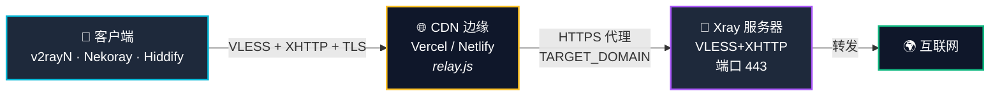
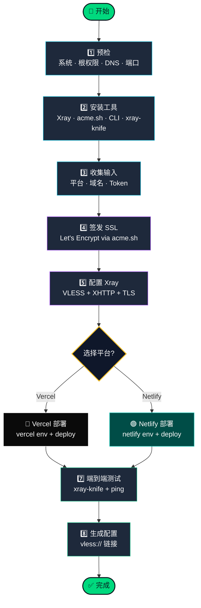

<div align="center">

<a href="https://t.me/avaco_cloud">
  
</a>

<br/>

### 🌐 自动化 VLESS + XHTTP + TLS 代理 — 使用 Vercel/Netlify CDN 转发

<br/>

**🌐 语言:** [🇮🇷 فارسی](README.md) • [🇬🇧 English](README_EN.md) • [🇨🇳 中文](README_ZH.md)

<br/>

[](https://t.me/avaco_cloud)
[](#)
[](#)
[](#)

<br/>

[](#)
[](#)
[](#)
[](#)

<br/>

### ⚡ 一键安装

</div>

```bash
bash <(curl -fsSL https://raw.githubusercontent.com/zsigoio/XHTTP-Installer/main/install.sh)
```

<div align="center">

---

</div>

## ✨ 这是什么？

一个 **一行命令** 的安装器，用于在 Ubuntu 上搭建 **VLESS + XHTTP + TLS** 代理，使用免费的 **Vercel** 或 **Netlify** CDN 作为转发层。

> [!TIP]
> 客户端不直接连接你的服务器（避免暴露 IP），流量通过知名 CDN 平台的边缘函数转发——你的真实服务器 IP 保持隐藏。

<br/>

### 🎯 为什么选择这个安装器？

| 特性 | 说明 |
|---------|-------------|
| 🌐 **无需网络域名** | 只需一个简单的子域名和 A 记录 |
| 🛠️ **零 CLI 麻烦** | 自动安装和认证 Vercel CLI 和 Netlify CLI |
| 🐛 **智能自动修复** | 检测并解决 SSL、防火墙、令牌和环境变量问题 |
| ✅ **端到端验证** | 使用 `xray-knife` 验证生成的配置是否可用 |
| 🔄 **失败自动重试** | 在修复问题后重新尝试部署/SSL |
| 🛡️ **隐藏服务器 IP** | 只有 CDN 边缘暴露在公网 |
| 🔐 **自动 SSL** | 通过 acme.sh 自动获取 Let's Encrypt 证书 |
| 🇨🇳 **国内友好** | 安装过程无需 VPN |

<br/>

---

## 🔄 工作原理

### 架构



> [!NOTE]
> **CDN 是公开层**，你的 **Xray 服务器是隐藏的**。外界只能看到 CDN 域名。

<br/>

### 自动化阶段



<br/>

<details open>
<summary><b>1️⃣ 第一阶段 — 预检</b></summary>

<br/>

检查服务器是否就绪：
- ✅ 操作系统是 Ubuntu 20.04+
- ✅ 以 **root** 身份运行
- ✅ 网络连接正常
- ✅ 端口 80 和 443 可用（如被占用自动修复）
- ✅ DNS 正确指向

</details>

<details>
<summary><b>2️⃣ 第二阶段 — 安装工具</b></summary>

<br/>

自动安装所有工具：

| 工具 | 用途 |
|------|---------|
| **Xray-core** | 代理核心（VLESS+XHTTP） |
| **acme.sh** | Let's Encrypt SSL 证书 |
| **Node.js + npm** | 平台 CLI 所需 |
| **Vercel CLI** | 如果你选择 Vercel |
| **Netlify CLI** | 如果你选择 Netlify |
| **xray-knife** | 端到端配置验证工具 |
| **curl, jq, unzip, screen** | 实用工具 |

> [!NOTE]
> 无需预先安装任何 CLI——脚本会处理安装和认证。

</details>

<details>
<summary><b>3️⃣ 第三阶段 — 收集输入</b></summary>

<br/>

交互式询问以下信息：

| 问题 | 示例 | 是否必填 |
|----------|---------|-----------|
| 平台 | Vercel / Netlify | ✅ |
| 域名 | `ns.example.com` | ✅ |
| SSL 邮箱 | `admin@example.com` | ⬜（默认） |
| Xray 端口 | `443` | ⬜（默认） |
| 转发路径 | `/api` | ⬜（默认） |
| **平台 Token** | Vercel/Netlify token | ✅ |
| 项目名称 | `relay-abc123` | ⬜（随机） |

</details>

<details>
<summary><b>4️⃣ 第四阶段 a — 签发 SSL 证书</b></summary>

<br/>

- 🔐 通过 `acme.sh` 从 **Let's Encrypt** 获取证书
- 📁 存储在 `/etc/ssl/xhttp/<域名>/`
- 🔄 如果端口 80 被占用自动修复
- ♻️ 启用自动续期

</details>

<details>
<summary><b>5️⃣ 第四阶段 b — 配置 Xray</b></summary>

<br/>

- 🎲 生成唯一的 **UUID**
- 📝 写入 `/usr/local/etc/xray/config.json`（VLESS+XHTTP+TLS）
- 🔑 修复 Xray 的 SSL 文件权限
- 🚀 启动并启用 Xray 服务
- ✅ 验证服务运行正常

</details>

<details>
<summary><b>6️⃣ 第四阶段 c — 部署到 CDN</b></summary>

<br/>

根据所选平台执行：

**🔵 Vercel：**
- 使用 Token 登录 → `vercel login`
- 创建项目 → `vercel project add`
- 设置环境变量：`TARGET_DOMAIN`、`UPSTREAM_PROTOCOL`、`RELAY_PATH`
- 部署到生产环境 → `vercel deploy --prod`

**🟢 Netlify：**
- 使用 Token 登录 → `netlify login`
- 创建站点 → `netlify sites:create`
- 设置环境变量：`TARGET_DOMAIN`
- 部署边缘函数 → `netlify deploy --prod`

> [!TIP]
> 如果部署失败，自动修复会在解决之前的问题（环境变量、名称冲突、Token）后重试。

</details>

<details>
<summary><b>7️⃣ 第五阶段 — 端到端测试</b></summary>

<br/>

- 🧪 使用 `xray-knife` 创建临时 xray 客户端
- 🌐 路由真实流量：CDN → 服务器 → 互联网
- ⏱️ 测量延迟（最小/平均/最大）
- ✅ 在你使用之前确认配置 **实际可用**

</details>

<details>
<summary><b>8️⃣ 第六阶段 — 生成最终配置</b></summary>

<br/>

- 📋 `vless://...` 链接，可直接复制使用
- 📊 完整报告：转发 URL、UUID、测试结果、延迟、质量
- 💾 完整日志：`/tmp/xhttp-install.log`

</details>

<br/>

---

## 📋 系统要求

### 1. Ubuntu 服务器

- **操作系统**：Ubuntu 20.04+（推荐 22.04）
- **访问权限**：root 或 sudo
- **端口**：80（用于 SSL）和 443（用于转发）
- **最低配置**：1 vCPU + 1 GB 内存
- **💡 低配小机**：内存低至 128MB 的 LXD 容器或 NAT 机器，请使用 `Deploy-NAT.sh`（精简版，无需 Node.js）

> [!IMPORTANT]
> 确保端口 80 和 443 未被占用。如果 nginx/apache 正在使用它们，请先停止这些服务。

### 2. 域名和 DNS

一个指向你 **服务器 IP** 的子域名 A 记录：
```
ns.example.com  →  你的_服务器_IP
```

### 3. CDN Token（二选一）

#### 🔵 Vercel Token
```
https://vercel.com/account/tokens
```
→ **创建 Token** → 命名 → 复制

#### 🟢 Netlify Token
```
https://app.netlify.com/user/applications#personal-access-tokens
```
→ **新建访问令牌** → 命名 → 复制

<br/>

---

## 🚀 快速开始

### 📥 第一步 — 一键安装

SSH 连接到你的服务器并运行：

```bash
bash <(curl -fsSL https://raw.githubusercontent.com/zsigoio/XHTTP-Installer/main/install.sh)
```

> [!TIP]
> 这会安装 `git`，克隆仓库到 `/root/XHTTP-Installer`，然后自动运行 `Deploy-Ubuntu.sh`。

**中文版脚本：**
> 如果你更喜欢中文界面，仓库中同时提供了 `ZH_Deploy-Ubuntu.sh`（全中文版），
> 所有提示、输出和交互信息均为中文。将上面命令中的 `install.sh` 替换为 `install-zh.sh` 即可使用，
> 或者手动运行：
> ```bash
> bash ZH_Deploy-Ubuntu.sh
> ```

**低配 / NAT 小机版：**
> 如果你的服务器内存很小（如 128MB LXD 容器）或处于 NAT 内网环境，
> 请使用 `Deploy-NAT.sh`（精简版，无需 Node.js / npm / CDN CLI）：
> ```bash
> bash Deploy-NAT.sh
> ```

<details>
<summary><b>备用方法</b></summary>

<br/>

**手动 git 克隆：**
```bash
git clone https://github.com/zsigoio/XHTTP-Installer.git /root/XHTTP-Installer
cd /root/XHTTP-Installer
sudo bash Deploy-Ubuntu.sh
```

**中文版手动运行：**
```bash
sudo bash ZH_Deploy-Ubuntu.sh
```

**低配/NAT 小机版手动运行：**
```bash
sudo bash Deploy-NAT.sh
```

**离线 zip：**
```bash
scp XHTTP-Installer.zip root@服务器_IP:/root/
ssh root@服务器_IP
cd /root && unzip XHTTP-Installer.zip && sudo bash Deploy-Ubuntu.sh
```

</details>

脚本首先询问是否在 `screen` 中运行：

- 如果你的 **网络不稳定** 或 SSH 经常断开 → 按 `Y`。如果 SSH 在安装中断开：
  ```bash
  ssh root@服务器_IP
  screen -r xhttp
  ```
- 如果连接稳定 → 按 `n` 直接继续

> [!TIP]
> 如果在 `screen` 中 SSH 断开，重新连接后运行 `screen -r xhttp` 即可恢复。

### 🎯 第二步 — 选择平台

```
[ 部署平台 ]
选择转发平台：
  1) Vercel
  2) Netlify
输入选择 [1/2]：
```

### ⚙️ 第三步 — 提供信息

脚本逐步询问。按 `Enter` 接受默认值：

| 问题 | 说明 | 示例 / 默认值 |
|----------|-------------|-------------------|
| **域名** | 指向服务器 IP 的子域名 | `ns.example.com` |
| **邮箱** | SSL 证书邮箱（可选） | `admin@ns.example.com` |
| **入站端口** | Xray 监听端口 | `443` |
| **RELAY_PATH** | 服务器上的入站路径 | `/api` |
| **PUBLIC_RELAY_PATH** | CDN 上的转发路径 | `/api` |
| **Token** | Vercel 或 Netlify token | 粘贴即可 |
| **项目名称** | CDN 站点名称（默认随机） | `relay-abc123` |
| **性能设置** | 仅 Vercel（Enter = 默认） | `128`、`50000`…… |

### 🎉 第四步 — 等待并获取配置

```
╔══════════════════════════════════════════╗
║       安装完成  ✔                      ║
╚══════════════════════════════════════════╝

  平台             : netlify
  转发 URL         : https://your-site.netlify.app
  
  端到端代理测试   : ✔ 通过
  延迟（最小/平均/最大）: 395/424/480 ms
  质量             : 良好

── 客户端配置 ──

vless://xxxxxxxx...@your-site.netlify.app:443?...#XHTTP-netlify
```

✅ 复制 `vless://...` 链接。

<br/>

---

## 📱 使用配置

| 平台 | 应用 | 使用方法 |
|----------|-----|-----|
| 🪟 Windows | [v2rayN](https://github.com/2dust/v2rayN/releases) | 服务器 → 从剪贴板导入批量 URL |
| 🤖 Android | [v2rayNG](https://play.google.com/store/apps/details?id=com.v2ray.ang) | + → 从剪贴板导入配置 |
| 🍎 iOS | Streisand（App Store）| 自动从剪贴板检测 |
| 🐧 Linux | [Nekoray](https://github.com/MatsuriDayo/nekoray/releases) | 程序 → 从剪贴板添加配置 |
| 🌐 全平台 | [Hiddify](https://hiddify.com) | 添加 → 从剪贴板添加 |

<br/>

---

## 🛠️ 脚本特性

### 🤖 智能自动修复

| 问题 | 自动修复 |
|-------|----------|
| 端口 80 被占用 | 终止占用进程 |
| 防火墙阻止 | 自动执行 `ufw allow` |
| Xray + SSL 密钥权限 | 自动执行 `chmod` + `chgrp` |
| systemd 服务问题 | drop-in 覆盖 |
| Token 无效 | 重新提示输入新 Token |
| Netlify 名称冲突 | 自动生成新随机名称 |

### 🧪 端到端测试

部署后，脚本使用临时 xray 客户端测试代理：

```
✔ VLESS+XHTTP 端到端工作正常
  HTTP 204 in 0.475s — 代理功能正常
  延迟（最小/平均/最大）: 395/424/480 ms（通过 VLESS）
  质量: 良好
```

这样**在你打开客户端之前**，你就知道代理是否可用。

<br/>

---

## 🐛 故障排除

<details>
<summary><b>❌ Xray "权限不足" (privkey.pem)</b></summary>

<br/>

脚本通过 systemd drop-in **自动修复**此问题。手动修复：
```bash
chmod 640 /etc/ssl/xhttp/你的域名/privkey.pem
chgrp nobody /etc/ssl/xhttp/你的域名/privkey.pem
```
</details>

<details>
<summary><b>❌ Netlify 返回 HTTP 500（配置错误）</b></summary>

<br/>

未设置 `TARGET_DOMAIN` 环境变量。自动重试通常会修复。手动：
```bash
cd /root/deploy/netlify
netlify env:set TARGET_DOMAIN "https://你的域名:443" \
  --scope functions --context production --site 站点_ID
netlify deploy --prod
```
</details>

<details>
<summary><b>❌ 转发返回 HTTP 404</b></summary>

<br/>

对于非 VLESS 请求是**正常现象**。`curl` 返回 404，因为它不发送 VLESS 握手。真实客户端（v2rayN、Nekoray……）可以正常工作。
</details>

<details>
<summary><b>📝 完整日志</b></summary>

<br/>

```bash
tail -f /tmp/xhttp-install.log
```
</details>

<br/>

---

## 🛡️ 道德与法律

> [!WARNING]
> 此项目的唯一目的是 **绕过不公正的限制** 和 **保护隐私**。
> 
> ❌ 请**不要**将其用于恶意活动、攻击或侵犯他人隐私。
> 
> ❌ 请**不要**在**未获得许可**的情况下使用他人的域名/Token。
> 
> ✅ 仅在 **你自己的** 服务器和 CDN 账户上使用。

<br/>

---

## 📜 许可证与版权

本项目采用 **[GNU GPL-3.0](LICENSE)** 许可证。

**版权所有 © 2025 [@avaco_cloud](https://t.me/avaco_cloud)**

> [!IMPORTANT]
> ✅ **允许**个人和商业使用
> ✅ **允许**修改和分叉
> 
> ❗ 但是，**任何复制、分叉或重新分发** 都必须保留：
> - 📌 原始版权声明（`Copyright © 2025 avaco_cloud`）
> - 📌 指向原始仓库的链接：https://github.com/zsigoio/XHTTP-Installer
> - 📌 对 [@avaco_cloud](https://t.me/avaco_cloud) 作为原始作者的署名
> - 📌 `LICENSE` 文件不得更改
> 
> ❌ 删除或修改上述内容属于 **侵犯版权**，将导致 **DMCA 删除通知**。

如果你发现有人使用此代码 **未遵守许可证规定**，请联系 [@avaco_cloud](https://t.me/avaco_cloud)。

<br/>

---

<div align="center">

## 💖 支持

如果这个项目帮助了你，可以考虑加密货币捐赠：

<a href="https://nowpayments.io/donation?api_key=53edc3b4-8a65-451a-9ca9-67c30519c7a5" target="_blank" rel="noreferrer noopener">
  
</a>

<br/><br/>

---

## 🙏 致谢

特别感谢以下出色的开发者给予的灵感和贡献：

<table>
<tr>
<td align="center">
<a href="https://github.com/amirshaker000">
<br/>
<b>@amirshaker000</b>
</a>
</td>
<td align="center">
<a href="https://github.com/B3hnamR">
<br/>
<b>@B3hnamR</b>
</a>
</td>
</tr>
</table>

<br/>

---

## 💬 有问题？

📢 **Telegram：** [@avaco_cloud](https://t.me/avaco_cloud)

<br/>

**如果你觉得这个项目有用，给它一个 ⭐ 并分享给更多人！**

<br/>

由 [@avaco_cloud](https://t.me/avaco_cloud) 用 ❤️ 制作

</div>
